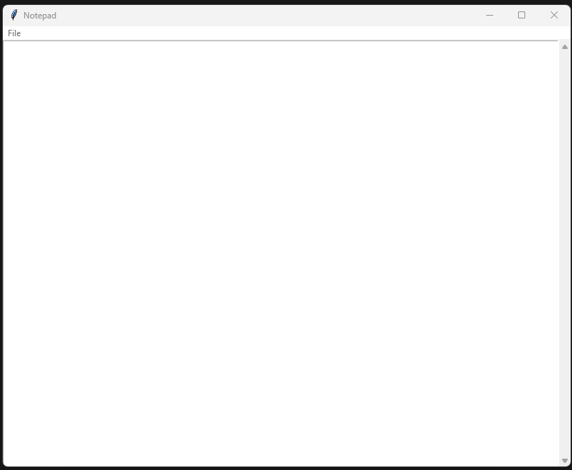
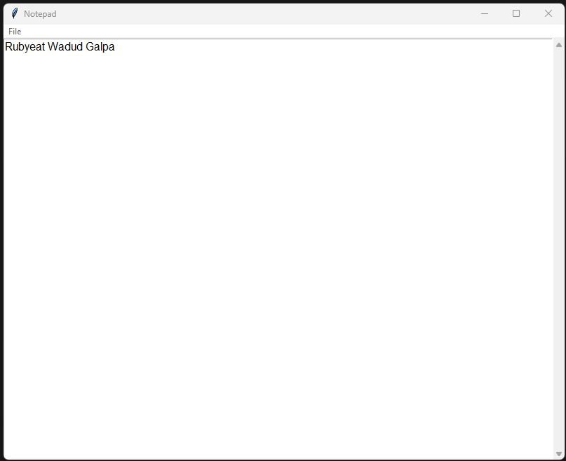

# 📝  Notepad in Python

A lightweight Notepad application built using Python and Tkinter. This app allows you to create, open, edit, and save text files in a clean and simple interface.

## 💡 Features

- ✅ Create a new text file
- 📂 Open existing `.txt` files
- 💾 Save and Save As functionality
- 🖋️ Simple and clean UI with scrollable text area

## 📸 Screenshot

